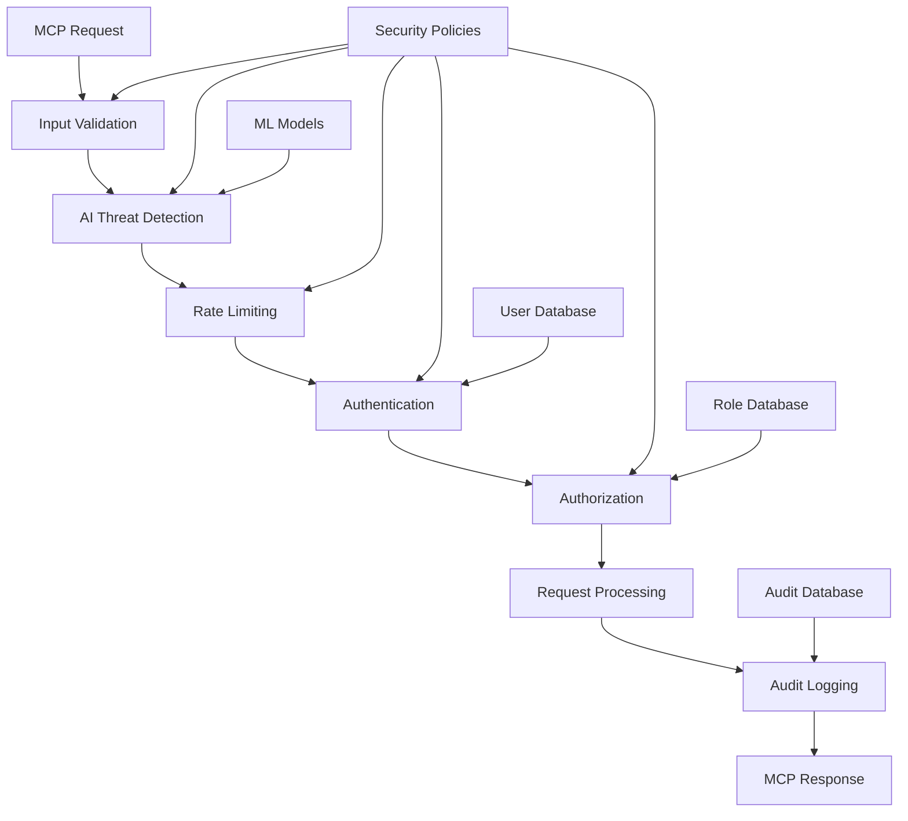

# SMCPv1 - Secure Model Context Protocol

[](https://opensource.org/licenses/MIT)
[](https://pypi.org/project/smcp-security/)
[](https://www.npmjs.com/package/smcp-security)
[](https://pkg.go.dev/github.com/wizardscurtain/SMCPv1/libraries/go)
[](https://crates.io/crates/smcp-security)
[](https://search.maven.org/artifact/com.smcp/smcp-security)
[](https://www.nuget.org/packages/SMCP.Security/)
[](https://marketplace.visualstudio.com/items?itemName=smcp-security.smcp-security)

A comprehensive, production-ready security framework for Model Context Protocol (MCP) implementations. SMCPv1 provides multi-layered security, AI-immune threat detection, and seamless integration across multiple programming languages.

## 🚀 Quick Start

### Choose Your Language

#### Python
```bash
pip install smcp-security
```

```python
from smcp_security import SMCPSecurityFramework

security = SMCPSecurityFramework()
validated_request = security.validate_request(mcp_request)
```

#### Node.js/TypeScript
```bash
npm install smcp-security
```

```typescript
import { SMCPSecurityFramework } from 'smcp-security';

const security = new SMCPSecurityFramework();
const validatedRequest = await security.validateRequest(mcpRequest);
```

#### Go
```bash
go get github.com/wizardscurtain/SMCPv1/libraries/go@v1.0.0
```

```go
import "github.com/wizardscurtain/SMCPv1/libraries/go/smcp"

security, _ := smcp.NewSecurityFramework(nil)
validatedRequest, _ := security.ValidateRequest(ctx, request)
```

#### Rust
```bash
cargo add smcp-security
```

```rust
use smcp_security::SecurityFramework;

let security = SecurityFramework::new(Default::default()).await?;
let validated_request = security.validate_request(&request).await?;
```

#### Java
```xml
<dependency>
    <groupId>com.smcp</groupId>
    <artifactId>smcp-security</artifactId>
    <version>1.0.0</version>
</dependency>
```

```java
SMCPSecurityFramework security = new SMCPSecurityFramework();
MCPRequest validatedRequest = security.validateRequest(request);
```

#### C#
```bash
dotnet add package SMCP.Security
```

```csharp
var security = new SMCPSecurityFramework();
var validatedRequest = await security.ValidateRequestAsync(request);
```

#### VS Code Extension
1. Open VS Code
2. Go to Extensions (Ctrl+Shift+X)
3. Search for "SMCP Security"
4. Click Install
5. Right-click project folder → "Initialize SMCP Security"

## 🛡️ Security Features

### Multi-Layered Defense
- **Input Validation**: Command injection, XSS, path traversal prevention
- **Authentication**: JWT with MFA support
- **Authorization**: Role-based access control (RBAC)
- **Rate Limiting**: Adaptive DoS protection
- **Encryption**: End-to-end data protection
- **AI-Immune System**: ML-based threat detection
- **Audit Logging**: Comprehensive security monitoring

### AI-Powered Threat Detection
- Real-time anomaly detection
- Behavioral analysis
- Attack pattern recognition
- Adaptive defense mechanisms
- Zero-day threat protection

### Production-Ready Performance
- **Minimal Overhead**: < 1ms latency impact
- **High Throughput**: 10,000+ requests/second
- **Memory Efficient**: < 50MB footprint
- **Horizontally Scalable**: Cloud-native architecture
- **Framework Agnostic**: Works with any MCP implementation

## 📚 Libraries & Integration

### Core Libraries

| Language | Package | Installation | Documentation |
|----------|---------|--------------|---------------|
| **Python** | [`smcp-security`](https://pypi.org/project/smcp-security/) | `pip install smcp-security` | [📖 Docs](libraries/python/README.md) |
| **Node.js** | [`smcp-security`](https://www.npmjs.com/package/smcp-security) | `npm install smcp-security` | [📖 Docs](libraries/nodejs/README.md) |
| **Go** | [`github.com/wizardscurtain/SMCPv1/libraries/go`](https://pkg.go.dev/github.com/wizardscurtain/SMCPv1/libraries/go) | `go get github.com/wizardscurtain/SMCPv1/libraries/go@v1.0.0` | [📖 Docs](libraries/go/README.md) |
| **Rust** | [`smcp-security`](https://crates.io/crates/smcp-security) | `cargo add smcp-security` | [📖 Docs](libraries/rust/README.md) |
| **Java** | [`com.smcp:smcp-security`](https://search.maven.org/artifact/com.smcp/smcp-security) | Maven/Gradle dependency | [📖 Docs](libraries/java/README.md) |
| **C#** | [`SMCP.Security`](https://www.nuget.org/packages/SMCP.Security/) | `dotnet add package SMCP.Security` | [📖 Docs](libraries/csharp/README.md) |

### Developer Tools

| Tool | Platform | Installation | Features |
|------|----------|--------------|----------|
| **VS Code Extension** | [Visual Studio Marketplace](https://marketplace.visualstudio.com/items?itemName=smcp-security.smcp-security) | Search "SMCP Security" | Code snippets, config UI, testing tools, audit viewer |

### Framework Support

#### Python
- ✅ FastAPI
- ✅ Flask
- ✅ Django
- ✅ Starlette

#### Node.js/TypeScript
- ✅ Express
- ✅ Fastify
- ✅ Koa
- ✅ NestJS

#### Go
- ✅ Gorilla Mux
- ✅ Gin
- ✅ Echo
- ✅ Fiber

#### Rust
- ✅ Axum
- ✅ Warp
- ✅ Actix-web
- ✅ Rocket

#### Java
- ✅ Spring Boot
- ✅ Quarkus
- ✅ Micronaut
- ✅ Helidon

#### C#
- ✅ ASP.NET Core
- ✅ Minimal APIs
- ✅ Blazor
- ✅ gRPC

## 🏗️ Architecture



### Security Layers

1. **Input Validation Layer**
   - Schema validation
   - Content sanitization
   - Injection attack prevention
   - Path traversal protection

2. **AI Threat Detection Layer**
   - Anomaly detection
   - Behavioral analysis
   - Pattern recognition
   - Risk scoring

3. **Rate Limiting Layer**
   - Per-user limits
   - Per-IP limits
   - Adaptive thresholds
   - DoS protection

4. **Authentication Layer**
   - JWT token validation
   - Multi-factor authentication
   - Session management
   - Token refresh

5. **Authorization Layer**
   - Role-based access control
   - Permission validation
   - Resource-level security
   - Dynamic policies

6. **Audit Layer**
   - Security event logging
   - Compliance reporting
   - Real-time monitoring
   - Forensic analysis

## 🔧 Configuration

### Basic Configuration

```json
{
  "security": {
    "enableInputValidation": true,
    "validationStrictness": "maximum",
    "enableMFA": true,
    "enableRBAC": true,
    "enableRateLimiting": true,
    "defaultRateLimit": 100,
    "enableAIImmune": true,
    "anomalyThreshold": 0.8,
    "enableAuditLogging": true
  }
}
```

### Advanced Configuration

```json
{
  "security": {
    "inputValidation": {
      "strictness": "maximum",
      "maxRequestSize": "1MB",
      "allowedMethods": ["tools/list", "tools/call"],
      "blockedPatterns": ["../", "<script>", "DROP TABLE"]
    },
    "authentication": {
      "jwtSecret": "${JWT_SECRET}",
      "expirySeconds": 3600,
      "mfa": {
        "enabled": true,
        "issuer": "SMCP Security",
        "algorithm": "SHA1"
      }
    },
    "authorization": {
      "rbac": {
        "enabled": true,
        "defaultRole": "user",
        "roles": {
          "admin": ["*"],
          "user": ["tools:list", "tools:call"],
          "readonly": ["tools:list"]
        }
      }
    },
    "rateLimiting": {
      "global": 1000,
      "perUser": 100,
      "perIP": 200,
      "windowMs": 60000,
      "adaptive": true
    },
    "aiImmune": {
      "enabled": true,
      "anomalyThreshold": 0.8,
      "learningMode": false,
      "models": ["anomaly_detection", "threat_classification"]
    },
    "audit": {
      "enabled": true,
      "logLevel": "INFO",
      "destinations": ["file", "database", "siem"],
      "retention": "90d"
    }
  }
}
```

## 📊 Monitoring & Analytics

### Security Metrics

```python
metrics = security.get_security_metrics()
print(f"Total requests: {metrics.total_requests}")
print(f"Blocked requests: {metrics.blocked_requests}")
print(f"Threats detected: {metrics.threats_detected}")
print(f"Average response time: {metrics.average_response_time}ms")
```

### Real-time Monitoring

- **Security Dashboard**: Real-time threat visualization
- **Alert System**: Immediate notification of security events
- **Compliance Reports**: Automated compliance reporting
- **Performance Metrics**: Security overhead monitoring

### Integration with Monitoring Systems

- **Prometheus**: Metrics export
- **Grafana**: Dashboard visualization
- **ELK Stack**: Log aggregation and analysis
- **Splunk**: SIEM integration
- **DataDog**: APM integration

## 🧪 Testing & Validation

### Security Testing

```bash
# Run security test suite
python -m pytest tests/security/ -v

# Run penetration tests
python -m smcp_security.testing.pentest

# Run compliance tests
python -m smcp_security.testing.compliance
```

### Performance Testing

```bash
# Benchmark security overhead
python -m smcp_security.testing.benchmark

# Load testing
python -m smcp_security.testing.load_test --requests 10000 --concurrent 100
```

### Vulnerability Scanning

```bash
# Scan for known vulnerabilities
python -m smcp_security.testing.vuln_scan

# Check dependencies
python -m smcp_security.testing.dep_check
```

## 🚀 Deployment

### Docker

```dockerfile
FROM python:3.11-slim

RUN pip install smcp-security

COPY app.py .
COPY smcp-config.json .

EXPOSE 8000

CMD ["python", "app.py"]
```

### Kubernetes

```yaml
apiVersion: apps/v1
kind: Deployment
metadata:
  name: smcp-secure-app
spec:
  replicas: 3
  selector:
    matchLabels:
      app: smcp-secure-app
  template:
    metadata:
      labels:
        app: smcp-secure-app
    spec:
      containers:
      - name: app
        image: your-app:latest
        env:
        - name: SMCP_CONFIG
          valueFrom:
            configMapKeyRef:
              name: smcp-config
              key: config.json
        - name: JWT_SECRET
          valueFrom:
            secretKeyRef:
              name: smcp-secrets
              key: jwt-secret
```

### Cloud Platforms

- **AWS**: Lambda, ECS, EKS support
- **Google Cloud**: Cloud Run, GKE support
- **Azure**: Container Instances, AKS support
- **Render**: Native deployment support

## 📖 Documentation

### Getting Started
- [Installation Guide](docs/installation.md)
- [Quick Start Tutorial](docs/quickstart.md)
- [Configuration Reference](docs/configuration.md)

### Security Guides
- [Security Best Practices](docs/security-best-practices.md)
- [Threat Modeling](docs/threat-modeling.md)
- [Incident Response](docs/incident-response.md)

### API Documentation
- [Python API](libraries/python/README.md)
- [Node.js API](libraries/nodejs/README.md)
- [Go API](libraries/go/README.md)
- [Rust API](libraries/rust/README.md)
- [Java API](libraries/java/README.md)
- [C# API](libraries/csharp/README.md)

### Examples
- [Basic Usage Examples](examples/)
- [Framework Integration](examples/frameworks/)
- [Advanced Configurations](examples/advanced/)
- [Production Deployments](examples/production/)

## 🤝 Contributing

We welcome contributions! Please see our [Contributing Guide](CONTRIBUTING.md) for details.

### Development Setup

```bash
# Clone the repository
git clone https://github.com/wizardscurtain/SMCPv1.git
cd SMCPv1

# Install development dependencies
./scripts/setup-dev.sh

# Run tests
./scripts/test-all.sh

# Build all libraries
./scripts/build-all.sh
```

### Publishing Libraries

```bash
# Publish all libraries
./scripts/publish-all.sh

# Publish specific library
./scripts/publish-python.sh
./scripts/publish-nodejs.sh
./scripts/publish-go.sh
./scripts/publish-rust.sh
./scripts/publish-java.sh
./scripts/publish-csharp.sh
./scripts/publish-vscode.sh
```

## 🔒 Security

### Reporting Security Issues

For security issues, please email **security@smcp.dev** instead of using the issue tracker.

### Security Advisories

- [Security Policy](SECURITY.md)
- [Vulnerability Disclosure](docs/vulnerability-disclosure.md)
- [Security Advisories](https://github.com/wizardscurtain/SMCPv1/security/advisories)

### Compliance

- **SOC 2 Type II**: Compliant
- **ISO 27001**: Aligned
- **GDPR**: Privacy by design
- **HIPAA**: Healthcare ready
- **PCI DSS**: Payment card industry compliant

## 📄 License

This project is licensed under the MIT License - see the [LICENSE](LICENSE) file for details.

## 🙏 Acknowledgments

- [Model Context Protocol](https://github.com/modelcontextprotocol) team for the foundational protocol
- Security researchers and contributors
- Open source community for libraries and tools

## 📞 Support

- 📧 **Email**: support@smcp.dev
- 💬 **Discussions**: [GitHub Discussions](https://github.com/wizardscurtain/SMCPv1/discussions)
- 🐛 **Issues**: [GitHub Issues](https://github.com/wizardscurtain/SMCPv1/issues)
- 📖 **Documentation**: [docs.smcp.dev](https://docs.smcp.dev)
- 🌐 **Website**: [smcp.dev](https://smcp.dev)

---

<div align="center">

**Made with ❤️ by the SMCP Security Team**

[⭐ Star us on GitHub](https://github.com/wizardscurtain/SMCPv1) • [🐦 Follow on Twitter](https://twitter.com/smcp_security) • [💼 LinkedIn](https://linkedin.com/company/smcp-security)

</div>
