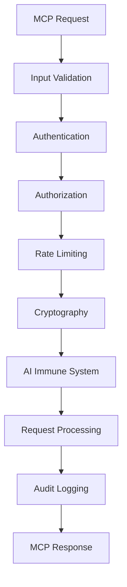

# SMCPv1 - Secure Model Context Protocol

[](https://opensource.org/licenses/MIT)
[](https://www.python.org/)
[](https://github.com/wizardscurtain/SMCPv1)

A Python security framework for Model Context Protocol (MCP) implementations. SMCPv1 provides multi-layered security with AI-enhanced threat detection.

> **⚠️ Status: Beta** - This project is under active development. The Python implementation is functional but not yet production-tested. Performance benchmarks and security audits are pending.

## 🚀 Quick Start

### Installation

```bash
# Install from source (PyPI publication pending)
git clone https://github.com/wizardscurtain/SMCPv1.git
cd SMCPv1/code
pip install -r requirements.txt
```

### Basic Usage

```python
from smcp_security import SMCPSecurityFramework
from smcp_security.config import SecurityConfig

# Initialize with default configuration
config = SecurityConfig()
security = SMCPSecurityFramework(config)

# Process an MCP request
async def handle_request(mcp_request, user_context):
    result = await security.process_request(mcp_request, user_context)
    return result
```

### Run the Examples

```bash
cd code/examples
python basic_usage.py
```

## 🛡️ Security Features

### Multi-Layered Defense Architecture

1. **Input Validation Layer** (`input_validation.py`)
   - JSON schema validation
   - Command injection detection (6 pattern categories)
   - Prompt injection detection (11+ suspicious patterns)
   - XSS, SQL injection, path traversal prevention
   - Context-aware sanitization

2. **Authentication Layer** (`authentication.py`)
   - JWT token generation and validation
   - Multi-factor authentication (TOTP/QR codes)
   - Session management with timeout and IP tracking
   - Failed attempt tracking with lockout (5 attempts, 15 min)
   - Token refresh and revocation

3. **Authorization Layer** (`authorization.py`)
   - Role-based access control (RBAC)
   - Role inheritance and hierarchies
   - Permission wildcards (e.g., `mcp:*`)
   - Conditional permissions (time-based, IP-based)
   - Permission caching with TTL

4. **Rate Limiting Layer** (`rate_limiting.py`)
   - Adaptive rate limiting with reputation scoring
   - Multiple limit types (RPS, RPM, RPH, bandwidth, concurrent)
   - Bot detection via statistical analysis
   - DoS protection with pattern analysis
   - Whitelist/blacklist management

5. **Cryptographic Layer** (`cryptography.py`)
   - ChaCha20-Poly1305 AEAD encryption
   - Argon2id key derivation
   - Key lifecycle management (rotation, expiration)
   - Session key generation with TTL
   - Secure password hashing

6. **AI Immune System** (`ai_immune.py`)
   - Pattern-based anomaly detection (always active)
   - Optional ML-based detection (Isolation Forest, DBSCAN)
   - 15-feature extraction system
   - Threat classification (7 categories)
   - Behavioral profiling and baseline establishment

7. **Audit & Monitoring** (`audit.py`)
   - Security event logging with severity levels
   - Automatic incident detection and correlation
   - Thread-safe event storage
   - Event export (JSON, CSV)
   - Security metrics tracking

### What Works NOW

✅ Full Python implementation (~4,700 lines)
✅ Comprehensive test suite (~6,500+ lines of tests)
✅ Working examples demonstrating attack blocking
✅ Async/await architecture for high concurrency
✅ Real cryptography (ChaCha20, Argon2)
✅ Real ML anomaly detection (optional, with pattern fallback)

### What's Missing

⚠️ Persistent storage (currently in-memory only)
⚠️ Distributed rate limiting (single-node only)
⚠️ Production logging integration
⚠️ Performance benchmarks (pending)
⚠️ Third-party security audit (pending)
⚠️ PyPI package publication (pending)

## 🏗️ Architecture


```mermaid
graph TB
    A[MCP Request] --> B[Input Validation]
    B --> C[Authentication]
    C --> D[Authorization]
    D --> E[Rate Limiting]
    E --> F[Cryptography]
    F --> G[AI Immune System]
    G --> H[Request Processing]
    H --> I[Audit Logging]
    I --> J[MCP Response]
```

### Security-First Design

- **Defense in depth**: 6 sequential security layers
- **Fail-secure**: Rejects requests on any layer failure
- **Zero-trust**: Every request fully validated
- **Audit everything**: Comprehensive security logging
- **Adaptive**: ML-based threat detection learns over time

## 🔧 Configuration

### Basic Configuration

```python
from smcp_security.config import SecurityConfig

config = SecurityConfig(
    enable_input_validation=True,
    validation_strictness="standard",  # or "strict", "maximum"
    enable_authentication=True,
    enable_authorization=True,
    enable_rate_limiting=True,
    enable_cryptography=True,
    enable_ai_immune=True,
    enable_audit=True
)

security = SMCPSecurityFramework(config)
```

### Advanced Configuration

```python
config = SecurityConfig(
    # Input Validation
    validation_strictness="maximum",
    max_request_size_mb=1,

    # Authentication
    jwt_expiry_seconds=3600,
    enable_mfa=True,
    failed_attempt_threshold=5,
    lockout_duration_minutes=15,

    # Authorization
    default_role="user",
    enable_rbac=True,

    # Rate Limiting
    default_rate_limit=100,  # requests per minute
    enable_adaptive_rate_limiting=True,

    # Cryptography
    enable_encryption=True,
    key_rotation_days=90,

    # AI Immune System
    anomaly_threshold=0.8,
    enable_ml_detection=True,  # Requires scikit-learn

    # Audit
    audit_log_level="INFO",
    max_audit_events=10000
)
```

## 📊 Monitoring & Metrics

```python
# Get security metrics
metrics = security.get_security_metrics()

print(f"Total requests: {metrics['total_requests']}")
print(f"Blocked requests: {metrics['blocked_requests']}")
print(f"Threats detected: {metrics['threats_detected']}")
print(f"Average security score: {metrics['average_security_score']}")

# Get health status
health = security.health_check()
print(f"System healthy: {health['healthy']}")
print(f"Active components: {health['components']}")
```

## 🧪 Testing

### Run Tests

```bash
cd code
pip install -r requirements.txt -r requirements-dev.txt
pytest tests/ -v
```

### Test Coverage

```bash
pytest tests/ --cov=smcp_security --cov-report=html
open htmlcov/index.html
```

### Security Scanning

```bash
# Run security linter
bandit -r smcp_security/

# Check dependencies for vulnerabilities
safety check -r requirements.txt
```

## 📦 Dependencies

### Core Dependencies (Required)

- `cryptography>=41.0.0` - ChaCha20-Poly1305 encryption
- `PyJWT>=2.8.0` - JWT authentication
- `argon2-cffi>=23.1.0` - Key derivation
- `pyotp>=2.9.0` - MFA/TOTP support
- `qrcode>=7.4.0` - QR code generation for MFA
- `jsonschema>=4.20.0` - Input validation

### Optional Dependencies

- `scikit-learn>=1.3.0` - ML-based anomaly detection
- `numpy>=1.24.0` - Feature extraction
- `scipy>=1.11.0` - Statistical analysis
- `psutil` - Memory metrics

## 🚀 Deployment

### Docker (Example)

```dockerfile
FROM python:3.11-slim

WORKDIR /app

COPY code/requirements.txt .
RUN pip install -r requirements.txt

COPY code/ .

CMD ["python", "examples/basic_usage.py"]
```

### Environment Variables

```bash
export JWT_SECRET="your-secret-key-here"
export SMCP_LOG_LEVEL="INFO"
export SMCP_ENABLE_ML="true"
```

## 🗺️ Roadmap

### Phase 1: Foundation (Weeks 1-2) - IN PROGRESS
- [x] Core Python implementation
- [x] Comprehensive test suite
- [ ] Fix remaining test failures
- [ ] Clean documentation

### Phase 2: Production Readiness (Weeks 3-6)
- [ ] Add PostgreSQL for audit log persistence
- [ ] Add Redis for rate limiting and sessions
- [ ] Implement structured logging
- [ ] Create deployment guides

### Phase 3: Validation (Weeks 7-10)
- [ ] Load testing and benchmarks
- [ ] Third-party security audit
- [ ] Fix security findings
- [ ] Document real performance numbers

### Phase 4: Release (Weeks 11-12)
- [ ] Publish to PyPI as v1.0.0-beta
- [ ] Set up CI/CD pipeline
- [ ] Create production documentation
- [ ] Onboard first beta users

## 🤝 Contributing

We welcome contributions! Please see our [Contributing Guide](CONTRIBUTING.md) for details.

### Development Setup

```bash
git clone https://github.com/wizardscurtain/SMCPv1.git
cd SMCPv1/code

# Create virtual environment
python -m venv venv
source venv/bin/activate  # On Windows: venv\Scripts\activate

# Install dependencies
pip install -r requirements.txt -r requirements-dev.txt

# Run tests
pytest tests/ -v
```

## 🔒 Security

### Reporting Security Issues

For security vulnerabilities, please open a GitHub issue or contact the maintainers directly.

### Security Policy

See [SECURITY.md](SECURITY.md) for our security policy and vulnerability disclosure process.

### Security Status

- ✅ Input validation patterns implemented
- ✅ Cryptography using industry-standard libraries
- ✅ Authentication with proper token management
- ⚠️ No third-party security audit (yet)
- ⚠️ No formal compliance certifications
- ⚠️ Beta software - not yet production-tested

## 📄 License

This project is licensed under the MIT License - see the [LICENSE](LICENSE) file for details.

## 🙏 Acknowledgments

- [Model Context Protocol](https://github.com/modelcontextprotocol) team for the foundational protocol
- Open source security libraries: cryptography, PyJWT, argon2-cffi, pyotp
- Contributors and early testers

## 📞 Support

- 🐛 **Issues**: [GitHub Issues](https://github.com/wizardscurtain/SMCPv1/issues)
- 💬 **Discussions**: [GitHub Discussions](https://github.com/wizardscurtain/SMCPv1/discussions)
- 📖 **Documentation**: See `/docs` directory and code examples

---

<div align="center">

**Built for the MCP security community**

[⭐ Star us on GitHub](https://github.com/wizardscurtain/SMCPv1)

</div>
